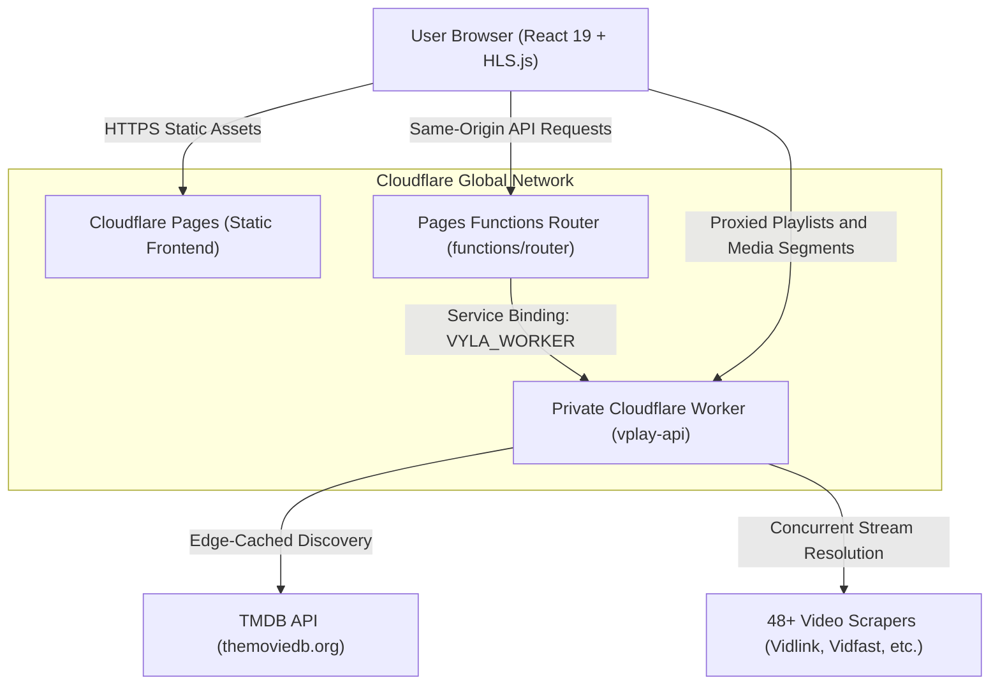

# V-Play — Modern Edge-Powered Streaming Platform

<div align="center">


<p align="center">
  A high-performance media streaming platform for Movies, TV Shows, and Anime, built with a Cinema Dark UI, real-time Server-Sent Events (SSE) streaming, and an edge-cached Cloudflare Worker backend.
</p>

</div>

---

> [!IMPORTANT]
> **Educational & Entertainment Disclaimer**:  
> V-Play is an experimental, open-source media player interface created strictly for **educational and research purposes**. V-Play does not host, upload, scrape, store, or distribute any video files, streams, or media on its own servers. All content discovery is powered by public APIs (such as TMDB), and stream resolution is performed via third-party external providers.

---

## Table of Contents

- [Overview](#overview)
- [Key Features](#key-features)
- [System Architecture](#system-architecture)
- [Technology Stack](#technology-stack)
- [Caching & Edge Security](#caching--edge-security)
- [Project Structure](#project-structure)
- [Local Development Setup](#local-development-setup)
- [Production Deployment](#production-deployment)
- [API & Architectural Documentation](#api--architectural-documentation)
- [Contributing & Code Quality](#contributing--code-quality)

---

## Overview

V-Play is engineered as a modern decoupled web application designed for global deployment on Cloudflare's edge network:

1. **Frontend**: A sleek, responsive Single Page Application (SPA) hosted on **Cloudflare Pages**, styled in a modern **Cinema Dark / OLED** visual system.
2. **Private Streaming Worker**: A standalone, self-contained Cloudflare Worker (`vplay-api`) executing the `@vyla-entertainment/sdk` to aggregate streams from 48+ external video scrapers without requiring an external VPS or Node.js server.
3. **Private Service Binding**: The worker is private (`workers_dev = false`) and communicates with Cloudflare Pages via zero-latency, same-origin internal Service Bindings (`VYLA_WORKER`).

---

## Key Features

### 🎬 Streaming & Playback Experience

- **Adaptive Bitrate Streaming**: Built on `hls.js` with dynamic quality switching (360p, 720p, 1080p, 4K) and auto-recovery.
- **Direct MP4 Playback**: Seamless fallback to native HTML5 video for direct MP4 sources.
- **Progressive Stream Discovery**: Real-time Server-Sent Events (SSE) stream endpoints (`/movie`, `/tv`) fan out concurrent scraper requests and yield playable links immediately.
- **Smart Stream Failover**: If an active stream server drops, the player seamlessly falls back to the next verified source without restarting the session.
- **Multi-Language Subtitles**: Embedded subtitle track selector with VTT/SRT styling and dedicated track fetching.

### 🌐 Live Discovery & Catalog Browsing

- **Dynamic TMDB Feeds**: Live **Top 10 This Week**, **Trending Anime**, **Popular Movies**, and **Binge-Worthy TV Series** proxied via the worker backend.
- **Dedicated Anime Filter**: Japanese animation is filtered at the edge (`with_genres=16&with_original_language=ja`) ensuring only authentic anime displays in anime shelves.
- **Zero Layout Shift (Instant First Paint)**: Ships with a curated skeleton catalog so initial page render occurs in 0ms before live network requests resolve.
- **Full-Bleed Hero Carousel**: Auto-advancing banner with cinematic vignettes, backdrop crossfades, and boundary-safe slide indexing.

### ⚡ Performance, Caching & Edge Security

- **3-Tier Caching System**: Frontend in-memory LRU cache (0ms tab switches), Cloudflare Edge CDN cache (1h TTL), and instant static fallback.
- **350ms Search Debouncing**: Eliminates network spam while typing search queries.
- **IP-Based Sliding-Window Rate Limiter**: Restricts catalog discovery to 60 req/min and streaming queries to 15 req/min with `429 Too Many Requests` + `Retry-After` headers.
- **Stateless HMAC Sessions**: Cryptographically signed SHA-256 session tokens with 30-minute expiration.

### 🎨 Cinema Dark Design & Accessibility

- **OLED Cinema Aesthetic**: Deep true-black surfaces (`#000000`), rose-red accents (`#E11D48`), and frosted glassmorphic navigation.
- **Display Typography**: Google Fonts **Bebas Neue** for dramatic cinematic headers and **Inter** for readable metadata.
- **Rank Badges**: Netflix-style numbered Top 10 shelf with oversized bottom-right gradient strokes.
- **Accessibility Hardened**: Full keyboard navigation (`group-focus-within` and `focus-visible` focus rings) and screen reader announcements (`role="status"`, `aria-live="polite"`).

---

## System Architecture



For complete architecture diagrams and data flow pipelines, read [docs/ARCHITECTURE.md](docs/ARCHITECTURE.md).

---

## Technology Stack

| Layer                    | Technologies                                              |
| ------------------------ | --------------------------------------------------------- |
| **Frontend Framework**   | React 19, TypeScript, Vite 8                              |
| **Styling & Icons**      | Tailwind CSS v4, Lucide React                             |
| **Video Engine**         | HLS.js, HTML5 Video API                                   |
| **Edge Hosting**         | Cloudflare Pages, Cloudflare Pages Functions              |
| **Backend & Scraping**   | Cloudflare Workers (`workerd`), `@vyla-entertainment/sdk` |
| **Metadata Provider**    | The Movie Database (TMDB) API                             |
| **Package Managers**     | `pnpm@10.11.1` (Pages frontend & Worker backend)          |
| **Linting & Formatting** | Oxlint, Prettier                                          |

---

## Project Structure

```
vplay/
├── docs/                        # Detailed architectural & API documentation
│   ├── ARCHITECTURE.md          # C4 diagrams, caching layers, and security flows
│   └── API.md                   # Endpoint specifications and SSE protocols
├── functions/                   # Cloudflare Pages Functions
│   └── [[path]].ts              # Service Binding proxy to private worker
├── public/                      # Static public web assets
├── src/                         # Frontend React application
│   ├── components/              # UI components (Hero, Shelves, Player, Modals)
│   │   ├── ContinueWatchingRow.tsx
│   │   ├── DisclaimerBanner.tsx
│   │   ├── Footer.tsx
│   │   ├── HeroBanner.tsx
│   │   ├── MediaCard.tsx
│   │   ├── MediaGrid.tsx
│   │   ├── MediaModal.tsx
│   │   ├── MediaRow.tsx
│   │   ├── Navbar.tsx
│   │   └── VideoPlayerModal.tsx
│   ├── data/                    # Static fallback catalog (curatedMedia.ts)
│   ├── hooks/                   # Custom React hooks (useStreamPlayer.ts)
│   ├── services/                # API and storage services (tmdbApi.ts, vylaApi.ts)
│   ├── types/                   # TypeScript interfaces (media.ts)
│   ├── App.tsx                  # Main application orchestrator
│   └── index.css                # Tailwind v4 theme & Google Fonts setup
├── worker/                      # Private Cloudflare Worker backend
│   ├── patches/                 # SDK runtime patches for Cloudflare Workers
│   │   └── @vyla-entertainment__sdk.patch
│   ├── src/                     # Worker TypeScript source
│   │   └── index.ts             # Vyla SDK runner, TMDB discovery & rate limiter
│   ├── package.json             # Worker dependencies (pinned to pnpm@10.11.1)
│   ├── pnpm-lock.yaml           # Worker lockfile
│   ├── pnpm-workspace.yaml      # Worker pnpm patch configuration
│   └── wrangler.jsonc           # Worker Wrangler configuration
├── package.json                 # Pages frontend dependencies
├── pnpm-lock.yaml               # Pages lockfile
├── vite.config.ts               # Vite build configuration
└── wrangler.toml                # Cloudflare Pages deployment & service binding configuration
```

---

## Local Development Setup

### Prerequisites

- **Node.js**: `v20.x` or higher (`v24.x` recommended)
- **pnpm**: `v10.11.1` (or modern `v10.x` matching Cloudflare build environment)

### 1. Clone the Repository

```bash
git clone https://github.com/carlodandan/vplay.git
cd vplay
```

### 2. Setup the Worker Backend

The worker runs locally on port `8787` using `pnpm`:

```bash
cd worker
pnpm install
pnpm dev
```

_The worker starts at `http://127.0.0.1:8787`._

### 3. Setup the Frontend

In a separate terminal, install dependencies and start the Vite development server using `pnpm`:

```bash
# Return to root directory
pnpm install
pnpm dev
```

_The application will open at `http://localhost:5173` and automatically proxy streaming queries to the local worker on port `8787`._

---

## Production Deployment

### 1. Deploy the Private Cloudflare Worker

```bash
cd worker
pnpm install

# Store your TMDB API Key as a Cloudflare Worker secret
npx wrangler secret put TMDB_API_KEY

# Deploy to Cloudflare (workers_dev = false)
pnpm run deploy
```

### 2. Deploy Cloudflare Pages

The root `wrangler.toml` binds directly to `vplay-api`:

```toml
name = "vplay"
pages_build_output_dir = "dist"
compatibility_date = "2024-09-23"
compatibility_flags = ["nodejs_compat"]

[[services]]
binding = "VYLA_WORKER"
service = "vplay-api"
```

Build the production bundle and deploy:

```bash
# Build the production client
pnpm run build

# Deploy to Cloudflare Pages
npx wrangler pages deploy dist
```

Alternatively, link your GitHub repository to Cloudflare Pages with:

- **Build command**: `pnpm run build`
- **Build output directory**: `dist`
- **Root directory**: `/`
- Under **Settings** → **Functions** → **Service Bindings**, add:
  - **Variable name**: `VYLA_WORKER`
  - **Service**: `vplay-api`

---

## API & Architectural Documentation

For deep technical breakdowns:

- **[docs/ARCHITECTURE.md](docs/ARCHITECTURE.md)**: C4 diagrams, sequence diagrams, edge caching tiers, and failover design.
- **[docs/API.md](docs/API.md)**: Full REST & Server-Sent Events (SSE) API specification, parameters, and status codes.
- **[worker/README.md](worker/README.md)**: Cloudflare Worker internal setup, runtime patches, and scraper configurations.

---

## Contributing & Code Quality

To maintain strict code quality standards:

```bash
# Lint with Oxlint
pnpm run lint

# Check code formatting with Prettier
pnpm run format:check

# Auto-fix formatting
pnpm run format:fix

# Type-check and production build
pnpm run build
```

---

## License & Disclaimer

Distributed under the MIT License. See `LICENSE` for more information.

_VPlay is an independent software project and is not affiliated with, endorsed by, or associated with TMDB, Netflix, or any third-party streaming providers._
