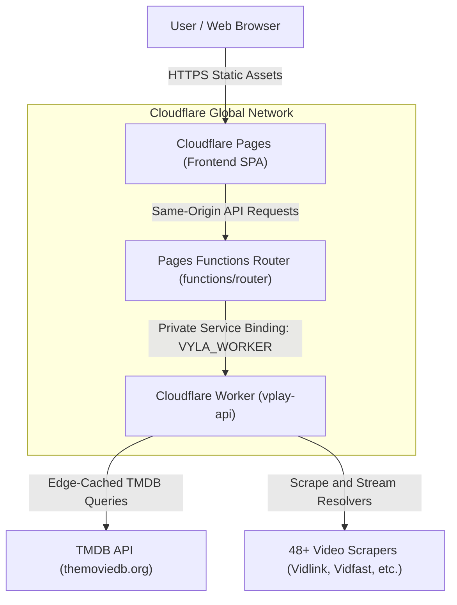
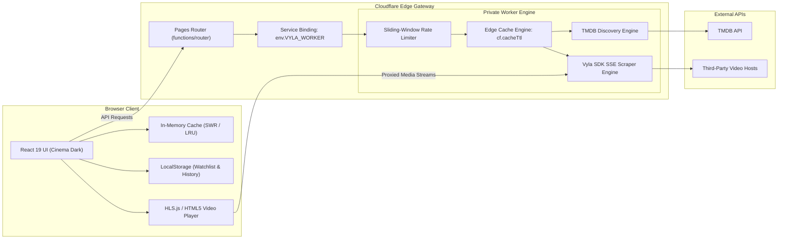
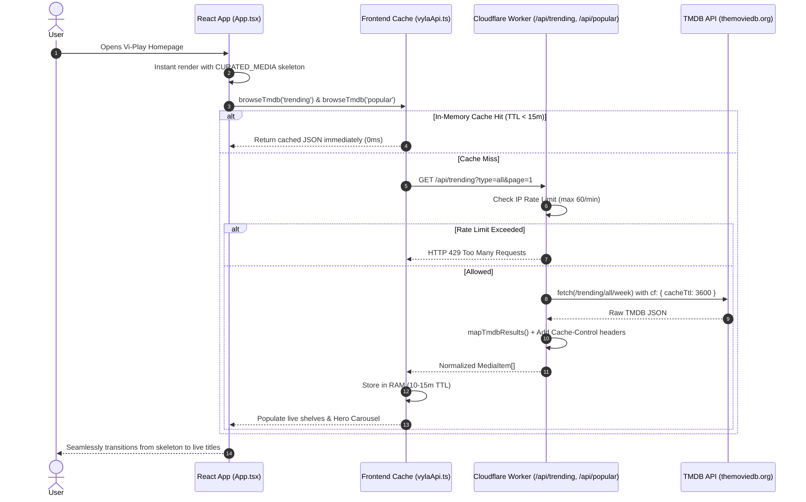
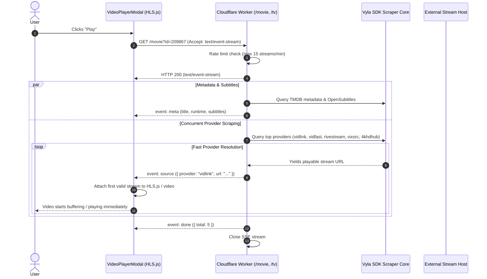

# Vi-Play Architecture & System Design

This document details the architectural design, data pipelines, caching tiers, security models, and runtime flows of **Vi-Play**.

---

## 1. System Overview

Vi-Play is a modern media streaming interface built on top of Cloudflare's serverless edge infrastructure. It splits responsibilities into two decoupled layers:
1. **Frontend**: A high-performance, single-page client built with React 19, Vite 8, and Tailwind CSS v4, deployed to **Cloudflare Pages**.
2. **Backend**: A private, self-contained Cloudflare Worker (**`vplay-api`**) executing the `@vyla-entertainment/sdk` to aggregate streams from 48+ external video scrapers and proxy TMDB discovery metadata.

The two layers communicate seamlessly in production via **Cloudflare Service Bindings**, eliminating public origin exposure, CORS preflight bottlenecks, and the need for external virtual private servers (VPS).

---

## 2. C4 Architecture Diagrams

### 2.1 System Context

### 2.2 Container Diagram

---

## 3. Data Flow Pipelines

### 3.1 Live Discovery & Catalog Browsing

Vi-Play uses a tiered fallback mechanism to provide **instant first paint** with zero layout shift while fetching fresh metadata asynchronously.

---

### 3.2 Real-Time SSE Video Streaming

When a user clicks "Play", Vi-Play initiates a Server-Sent Events (SSE) connection. Sources are scraped concurrently across 48+ providers and streamed down progressively so playback can begin on the first healthy stream.

---

## 4. Multi-Tiered Caching Architecture

| Layer | Location | TTL | Target | Purpose |
|---|---|---|---|---|
| **Tier 1: Instant Skeleton** | Client Bundle (`curatedMedia.ts`) | Permanent | Initial Paint | Guarantees zero blank screen during cold boot or offline states. |
| **Tier 2: In-Memory Client Cache** | Browser RAM (`vylaApi.ts`) | 3–15 mins | Tab navigation, Search | Eliminates redundant network calls when toggling between Categories (Movies, TV, Anime). |
| **Tier 3: Cloudflare Edge Cache** | Cloudflare Global CDN | 1–24 hours | Upstream TMDB responses | Serves repeat regional queries in <10ms and protects TMDB API key limits. |
| **Tier 4: LocalStorage Cache** | Browser Storage | Persistent | Watchlist & Watch History | Preserves custom bookmarks, playback progress, and offline items across sessions. |

---

## 5. Edge Security & Abuse Prevention

### 5.1 Sliding-Window Rate Limiter
The Cloudflare Worker tracks incoming requests using an in-memory sliding-window counter keyed by the client's `CF-Connecting-IP` header:
* **Discovery Routes** (`/api/trending`, `/api/popular`, `/api/search`, `/api/details`): **60 requests/minute**.
* **Stream Resolvers** (`/movie`, `/tv`): **15 requests/minute**.
* **Penalty**: Returns `HTTP 429 Too Many Requests` with a `Retry-After: 30` header.
* **Garbage Collection**: Prunes stale timestamp arrays every 120 seconds to prevent worker memory leaks.

### 5.2 Cryptographic Stateless Sessions
* `POST /api/auth` generates tokens signed with SHA-256 HMAC:
  $$\text{token} = \text{vplay\_} + \text{timestamp} + \text{\_} + \text{HMAC}_{\text{secret}}(\text{IP} + \text{timestamp})$$
* Allows verification at the edge in 0ms with zero database lookups.
* Automatically expires after 30 minutes (1800s).

### 5.3 Client-Side Search Debouncing
Search input updates are debounced by **350ms** in `App.tsx`. Keystroke bursts while typing queries like `"interstellar"` produce a single API invocation instead of a dozen redundant network calls.

---

## 6. Video Streaming Engine

1. **Adaptive Bitrate (HLS)**: Managed by `hls.js`, dynamically adjusting between 360p, 720p, 1080p, and 4K based on network conditions.
2. **Direct MP4 Streams**: Automatically detected via URL patterns and loaded natively into the HTML5 video element.
3. **CORS & Playlist Proxying**: External m3u8 playlists that enforce strict CORS or origin policies are proxied through `/api?url=...`, which rewrites relative segment URIs and injects valid headers.
4. **Resilient Auto-Fallback**: If an active stream encounters a fatal error, `useStreamPlayer.ts` automatically steps down to the next available source in the priority list without interrupting user context.
