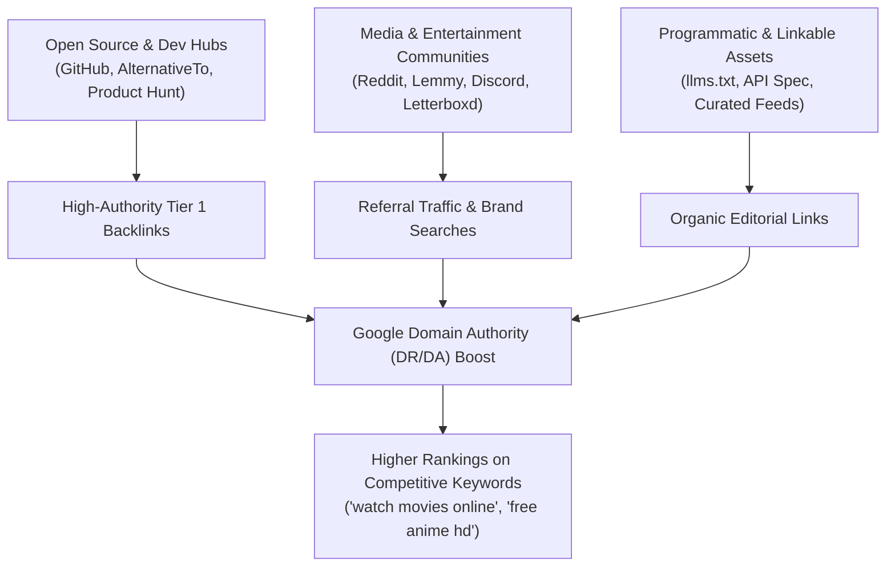
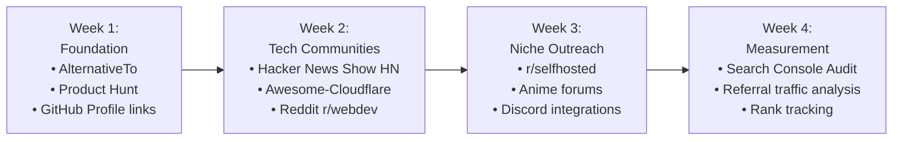

# Vi-Play — Comprehensive Backlink & Off-Page SEO Strategy

> An actionable, high-impact blueprint for acquiring authoritative, contextual, and durable backlinks to propel **Vi-Play** into top organic search positions on Google and AI search engines (Perplexity, ChatGPT, Gemini).

---

## 1. Executive Summary & Ranking Flywheel

Google's search algorithm and modern Generative Search Engines (Google AI Overviews, Perplexity, Bing Copilot) evaluate streaming platforms using three primary authority signals:
1. **Domain Trust & Co-Citations**: Do developer, media, and open-source ecosystems reference Vi-Play as a legitimate streaming platform?
2. **Contextual Topical Relevance**: Do high-relevance niche sites (anime blogs, tech communities, movie databases, self-hosted media forums) link to Vi-Play category pages (`/movies`, `/tv`, `/anime`)?
3. **Brand Searches & Referral Traffic**: Are users actively seeking "Vi-Play streaming", "Vi-Play anime", or clicking referral backlinks?

---

## 2. Pillar 1: High-Authority Directory & Aggregator Submissions

High Domain Rating (DR 70–95) directories provide authoritative `dofollow` foundation links and indexation signals.

| Target Platform | Category / Tag | Target Landing Page | Priority | Action Item |
|---|---|---|---|---|
| **AlternativeTo.net** (DR 82) | Movie Streaming / Stremio / Popcorn Time Alternative | `https://vi-play.pages.dev/` | High | Submit Vi-Play as an open-source, edge-hosted alternative to traditional streaming apps. Emphasize zero-VPS architecture. |
| **Product Hunt** (DR 91) | Web App / Streaming / Media Player | `https://vi-play.pages.dev/` | High | Launch Vi-Play highlighting Cinema Dark UI, instant SSE stream discovery, and Cloudflare Worker backend. |
| **SaaSHub** (DR 74) | Media Software / Open Source Video | `https://vi-play.pages.dev/` | High | List Vi-Play with feature tags (HLS.js, TMDB discovery, PWA). |
| **Indie Hackers** (DR 84) | Product Showcase | `https://vi-play.pages.dev/` | Medium | Post a case study: "Building a Serverless Video Aggregator on Cloudflare Edge with 0ms Cold Starts". |
| **Devpost / Dev.to** (DR 89) | Technical Tutorial | `https://vi-play.pages.dev/` | High | Write a tutorial linking to Vi-Play's GitHub and live demo on edge-powered streaming. |

---

## 3. Pillar 2: Developer & Open-Source Ecosystem Links

Google values GitHub and technical ecosystem citations as strong signals of authentic software projects.

1. **GitHub Repository Optimization**:
   - Set the repository homepage link strictly to `https://vi-play.pages.dev/`.
   - Add topical GitHub topics: `streaming`, `hls`, `react19`, `vite`, `cloudflare-workers`, `cloudflare-pages`, `tmdb-api`, `anime-streaming`.
   - Pin Vi-Play to creator GitHub profiles.

2. **Awesome-List Submissions**:
   - Submit Vi-Play to curated GitHub lists with high PageRank:
     - `awesome-cloudflare`: Under "Showcase" or "Open Source Projects on Cloudflare Workers/Pages".
     - `awesome-react`: Under "Media & Streaming Applications".
     - `awesome-hls`: Under "Open Source HLS Video Players".

3. **Community Discussions & Technical Showcases**:
   - **Show HN (Hacker News)**: "Show HN: Vi-Play – Edge-powered streaming client with instant SSE source resolution".
   - **Reddit r/selfhosted & r/webdev**: Share lessons learned about handling HLS streaming proxies, CORS workarounds, and Cloudflare Pages Service Bindings.
   - **Lemmy community (c/selfhosted, c/freemediahecklists)**: Mention Vi-Play as a clean, ad-free web interface.

---

## 4. Pillar 3: Linkable Assets & Programmatic Content

To earn editorial backlinks passively without outreach, publish linkable assets that users and creators naturally reference:

1. **`llms.txt` and AI Search Engines**:
   - Vi-Play now serves standard [`/llms.txt`](https://vi-play.pages.dev/llms.txt) and [`/llms-full.txt`](https://vi-play.pages.dev/llms-full.txt).
   - As AI search engines (Perplexity, ChatGPT Search) index these files, they cite `vi-play.pages.dev` as the direct source in user query responses, creating high-intent conversational referral loops.

2. **Crawlable Deep-Link URL Slugs**:
   - Every title now has a canonical slug: `/movie/693134/dune-part-two`, `/anime/1429/attack-on-titan`.
   - Users sharing favorite titles on Discord, Twitter/X, Reddit, or forums create natural, keyword-rich deep links containing the movie and show titles.

3. **Interactive Open API Specification**:
   - Maintain [`docs/API.md`](docs/API.md) and [`docs/ARCHITECTURE.md`](docs/ARCHITECTURE.md) publicly. Developers referencing scraper methodologies and SSE streaming mechanics link back to Vi-Play's documentation.

---

## 5. Pillar 4: Media, Anime & Entertainment Outreach

Target passionate entertainment sub-communities:

1. **Anime Communities (MAL / AniList / Reddit r/anime)**:
   - Create anime season watch-lists (e.g. "Top 10 Fall Anime to Stream in HD") linking directly to `/anime`.
   - Engage in discussions regarding subbed vs dubbed player controls and subtitle styling.

2. **Letterboxd & Movie Discussion Forums**:
   - In movie reviews or watch lists, reference Vi-Play as an interface for checking stream source health and trailer previews.

3. **Discord Bot & Stremio Addon Communities**:
   - Create a lightweight Discord bot or webhook integration that queries Vi-Play's `/api/trending` endpoint to post weekly top 10 movies into community servers, linking back to the platform.

---

## 6. Pillar 5: Competitor Backlink Gap Analysis

Use Ahrefs, Moz, or Semrush (or free backlink checkers):
1. **Analyze Competitors**: Look at backlink profiles of top open-source media interfaces and streaming aggregators.
2. **Find Unlinked Brand Mentions**: Monitor mentions of "Vi-Play" or "vplay" on Twitter/X, Reddit, and forums; request clickable links where omitted.
3. **Broken Link Replacement**: Search for defunct streaming web apps (e.g. decommissioned movie review or streaming tools) and reach out to bloggers who linked to them, suggesting Vi-Play as an active, modern edge-powered replacement.

---

## 7. 30-Day Execution Roadmap

- **Week 1**: Complete all directory submissions (AlternativeTo, Product Hunt, SaaSHub). Ensure Google Search Console is verifying sitemap indexation.
- **Week 2**: Submit GitHub repo to awesome lists; post technical writeup on Dev.to and Show HN.
- **Week 3**: Community outreach on Reddit and Lemmy focusing on open-source architecture and privacy (no sign-up, no tracking).
- **Week 4**: Review Google Search Console impressions for keywords like "Vi-Play", "watch anime hd", "free movie streaming interface"; refine meta tags for top-performing pages.
